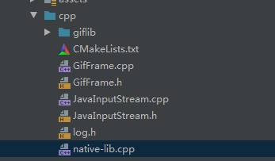
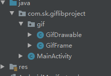

# GifLibProject
一个简单的使用giflib的例子,通过java层加载文件和C++层加载本地gif文件两种方式实现gif在页面上的绘制，有兴趣的可以看看，giflib的加载gif图片的性能还是很高的，作为一个能被收录源码的存在！

demo中giflib是以源码的形式导入的，而且针对jni方法分别使用了静态注册和动态注册的方式，有兴趣学习jni开发的也可以作为学习例子研究研究。

C++层代码目录：

java层代码目录：

